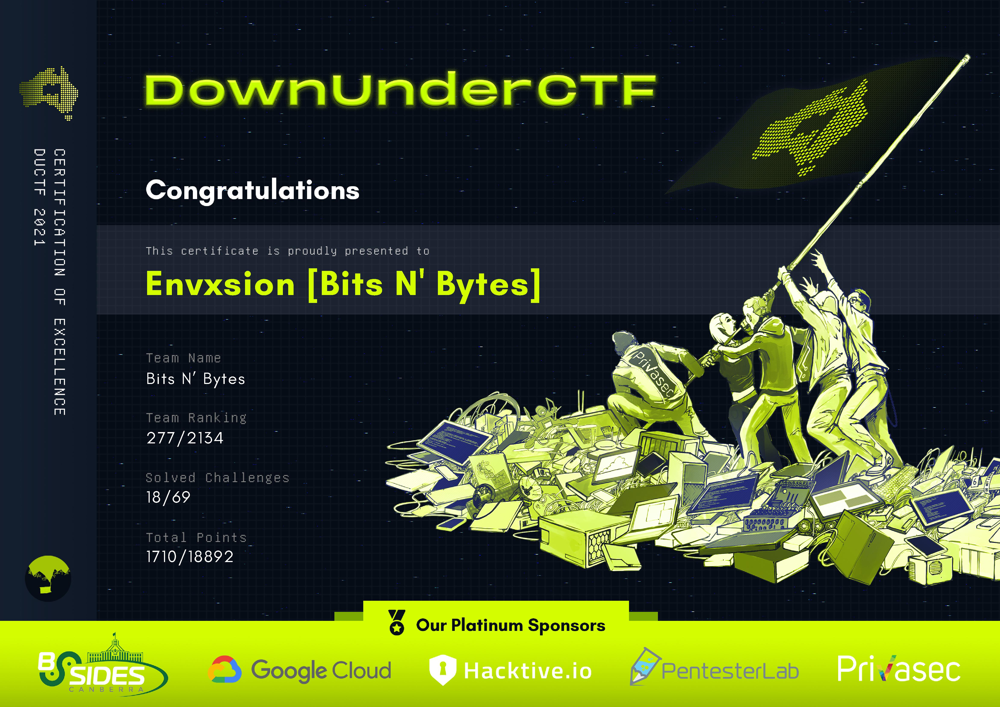
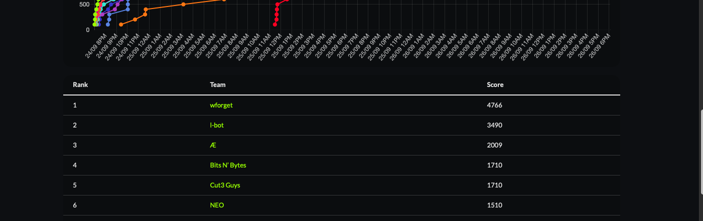
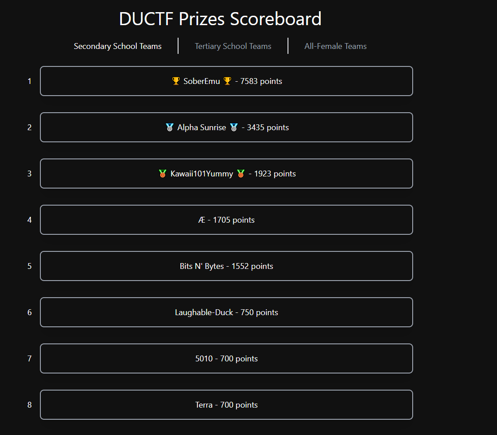

# 💫 About Me:
🔭 I’m currently working on expanding my portfolio by experimenting with all sorts of interesting technologies 🤝 I’m looking for help with Project Management, Cyber Security, AI/ML 🌱 I’m currently learning Python, Java, Web Dev, Data Science and Cyber Security ⚡ Love meeting and collaborating with new people who share similar interests

## 🌐 Socials:
  

# 💻 Tech Stack:
        
# 📊 GitHub Stats:
 
 

## 🏆 GitHub Trophies

---

# 📊 CTF Participation Statistics:
## 2021:

Placed 4th in the "High School only" category (Team Members: Cheeks, ScriptOverride, Foggy and Envxsion) 🦾 🚩 
https://github.com/DownUnderCTF/Challenges_2021_Public  

## 2022:

Placed 5th in the "High School only" category (Team Members: Envxsion) 🦾 🚩 
Placed 18th in the "High school and Teritary Students" category 🦾 🚩 
https://github.com/DownUnderCTF/Challenges_2022_Public  
